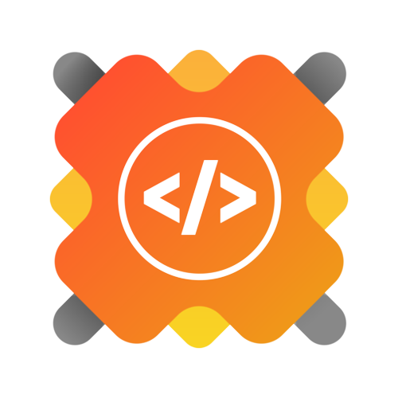
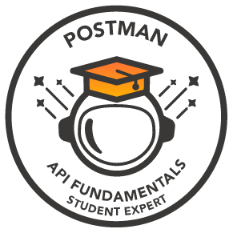

<!-- =========================================================
     MOHAMMAD AYAN — GITHUB PROFILE README
     ========================================================= -->

<div align="center">

# `mohammad@github:~$ whoami`

### Mohammad Ayan

**Software Engineer · Full Stack Developer · AI/ML Enthusiast**

[](https://ma-portfolio-6llp.onrender.com/)
[](https://www.linkedin.com/in/mohammadayan79/)
[](https://github.com/Ayan-Khan79)
[](https://leetcode.com/u/Ayan79/)

</div>

---

<div align="center">

### `ayan@github:~$ neofetch`

</div>

<table align="center">
<tr>
<td width="42%" align="center" valign="middle">



</td>

<td width="58%" valign="middle">

```text
┌─────────────────────────────────────────────┐
│              MOHAMMAD AYAN                  │
├─────────────────────────────────────────────┤
│                                             │
│  role       Software Engineer               │
│  focus      Full Stack Development          │
│  interests  AI / ML                         │
│  learning   AI Automation                   │
│  education  B.Tech CSE                      │
│                                             │
│  frontend   React · Vite · Tailwind         │
│  backend    Node · Express · Firebase       │
│  database   PostgreSQL · MongoDB            │
│  languages  C++ · Python · JavaScript       │
│                                             │
│  status     Building something new...       │
│                                             │
└─────────────────────────────────────────────┘
```

</td>
</tr>
</table>

<br>

<div align="center">

> **"I turn ideas into products, and problems into code."**

</div>

---

## `ayan@github:~$ ./contributions.sh`

<div align="center">



</div>

---

## `ayan@github:~$ cat about.txt`

I'm **Mohammad Ayan**, a Software Engineer and B.Tech CSE graduate focused on building practical, scalable applications.

I enjoy working across the stack — from designing interfaces with **React** and **Tailwind CSS** to building backend systems with **Node.js**, **Express**, **Firebase**, and databases such as **PostgreSQL** and **MongoDB**.

I'm currently exploring **AI Automation** and how AI can be integrated into real-world software workflows.

When I'm not coding, you'll probably find me following **Formula 1** 🏎️.

---

## `ayan@github:~$ ls ./projects`

<table>
<tr>

<td width="33%" valign="top">

### 🚀 MeTooMeat

A full-stack e-commerce platform focused on online meat ordering.

**Stack**

`React` `Vite` `Tailwind`
`Firebase` `Firestore`

**Features**

- Authentication
- Product management
- Admin dashboard
- Manual orders
- Revenue analytics
- Coupon system
- Order management

</td>

<td width="33%" valign="top">

### ⚡ HabitFlow

A productivity / habit management application designed to help users build consistent routines and track progress.

**Stack**

`React` `JavaScript`
`Firebase`

**Focus**

- Habit tracking
- Progress
- User experience
- Productivity

</td>

<td width="33%" valign="top">

### 🏎️ F1 Model Project

A machine-learning project exploring Formula 1 data and predictive modelling.

**Stack**

`Python` `NumPy`
`Pandas` `Matplotlib`
`Machine Learning`

**Focus**

- Data analysis
- Feature engineering
- Prediction
- Motorsport analytics

</td>

</tr>
</table>

<div align="center">

[](https://github.com/Ayan-Khan79?tab=repositories)

</div>

---

## `ayan@github:~$ cat tech-stack.json`

<div align="center">

### Languages


### Frontend


### Backend & Databases


### Tools


### Data & AI


`NumPy` · `Pandas` · `Matplotlib` · `Machine Learning`

</div>

---

## `ayan@github:~$ ./leetcode.sh`

<div align="center">

<a href="https://leetcode.com/u/Ayan79/">


</a>

<br>


</div>

---

## `ayan@github:~$ ./achievements.sh`

<div align="center">

### 🏆 Open Source & Achievements

</div>

<table align="center">
<tr>

<td align="center" width="33%">

### GirlScript Summer of Code



**Rank 595**

out of ~4000 participants

</td>

<td align="center" width="33%">

### Postman



**API Fundamentals**

Certified

</td>

<td align="center" width="33%">

### Open Source

🌎

**Contributor**

Actively exploring open-source development

</td>

</tr>
</table>

---

## `ayan@github:~$ git log --oneline --career`

```text
2026  B.Tech CSE Graduate
2026  Full Stack Developer Intern — Techplement
2026  GSSoC Contributor — Rank 595
2026  Building production-oriented applications
2026  Exploring AI Automation
```

---

## `ayan@github:~$ ./connect.sh`

<div align="center">

<a href="https://ma-portfolio-6llp.onrender.com/">

</a>

<a href="https://www.linkedin.com/in/mohammadayan-299344241/">

</a>

<a href="https://leetcode.com/u/Ayan79/">

</a>

<a href="mailto:mohammad.ayan9450@gmail.com">

</a>

</div>

<br>

<div align="center">

```text
┌───────────────────────────────────────────────┐
│                                               │
│       Thanks for stopping by! 👋             │
│                                               │
│       Keep building. Keep learning. 🚀       │
│                                               │
└───────────────────────────────────────────────┘
```

</div>
